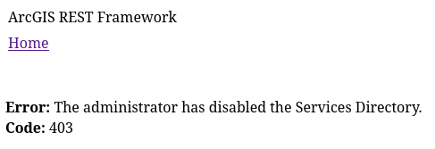

# ArcGISAudit

ArcGISAudit is a basic security auditing tool for ArcGIS Enterprise environments, designed for reconnaissance, misconfiguration discovery, and active vulnerability testing.

Built for penetration testers, red teamers, and security engineers to quickly identify exposed ArcGIS attack surfaces and validate real-world risk.

ArcGIS environments often expose far more than the HTML Services Directory. Even when the Services Directory is disabled, JSON and pjson REST endpoints, FeatureServer operations, portal surfaces, upload workflows, and management-related paths may still be reachable. ArcGISAudit is built to accelerate that enumeration so testers can spend less time mapping the surface and more time validating impact.

## Why ArcGISAudit?
Too often, testers see “Services Directory disabled” and stop there. In reality, ArcGIS environments can still expose a large and complex attack surface underneath the HTML interface. ArcGISAudit helps uncover that surface quickly, so you can spend less time on repetitive enumeration and more time validating real risk.

<p align="center">
    
</p>

---

## Features

* ArcGIS REST & Portal enumeration
* Service, layer, and metadata discovery
* Misconfiguration detection

  * Public ArcGIS queryable data exposure
  * Exposed ArcGIS REST service enumeration
  * Unpatched and unsupported ArcGIS version detection
  * FeatureServer edit operations reachable without authentication
  * Anonymous file-upload and attachment attack surfaces
  * Permissive CORS policies
  * Host header poisoning
  * ArcGIS Portal user information disclosure
  * Sensitive field/schema exposure
* Active testing (optional)
  * Edit operation validation
  * Query injection testing
  * Reflected XSS testing
  * Possible Stored XSS sink identification
  * SSRF via proxy endpoints
* Manual validation command generation (curl-ready)
* Report-ready findings with severity, narrative, and evidence

---

## Installation

```bash
git clone https://github.com/clayhax/ArcGISAudit.git
cd ArcGISAudit
```

No external dependencies required (standard Python3 libraries).

---

## Usage

```bash
python3 ArcGISAudit.py https://target/arcgis
```

---

## Common Examples

### Passive scan (safe reconnaissance)

```bash
python3 ArcGISAudit.py https://target/arcgis
```

### Full active scan

```bash
python3 ArcGISAudit.py https://target/arcgis --all
```

### Enable specific checks

```bash
python3 ArcGISAudit.py https://target/arcgis \
  --active-checks \
  --xss-checks \
  --query-injection-checks
```

### SSRF testing

```bash
python3 ArcGISAudit.py https://target/arcgis \
  --active-checks \
  --ssrf-test-url https://example.com/
```

### Admin mode (authenticated)

```bash
python3 ArcGISAudit.py https://target/arcgis \
  --admin-mode \
  --username admin \
  --password 'password'
```

---

## Flags

| Flag                       | Description                       |
| -------------------------- | --------------------------------- |
| `--all`                    | Enable all active checks          |
| `--active-checks`          | Enable intrusive testing          |
| `--xss-checks`             | Enable reflected XSS testing      |
| `--query-injection-checks` | Enable query injection testing    |
| `--ssrf-test-url`          | URL used for SSRF validation      |
| `--admin-mode`             | Attempt authenticated enumeration |
| `--threads`                | Concurrent worker threads         |
| `--timeout`                | HTTP timeout                      |
| `--out`                    | Output file prefix                |

---

## Output

ArcGISAudit generates:

* JSON report
* Text report

### Example Findings

```text
[HIGH] FeatureServer edit operation reachable without authentication
[HIGH] ArcGIS public file-upload attack surface exposed
[MEDIUM] Public ArcGIS queryable data exposure
[MEDIUM] Possible stored XSS sink in ArcGIS layer content
[INFO] ArcGIS Version Information Disclosure
```

---

## ⚠️ Disclaimer

This tool is intended for **authorized security testing only**.

Do not run against systems without explicit permission.

---

## 👤 Author

clayhax

---

## ⭐ Support

If you find this tool useful:

* Star the repo
* Report issues
* Contribute or tag me @0xclayhax on twitter with your ideas/suggestions to add

---

## 🔥 Roadmap

* Additional ArcGIS-specific vuln checks
